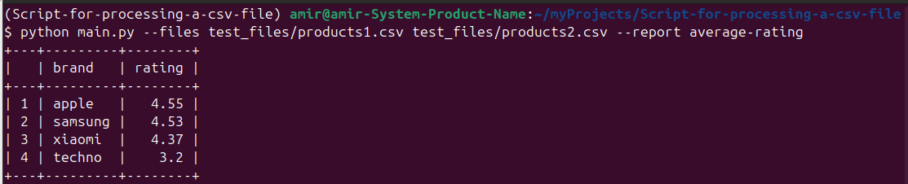

# Script-for-processing-a-csv-file


# Пример запуска скрипта


# Как добавить новый отчет?
Пример добавления функции
```python
@register_report("price-by-brand")
def price_by_brand_report(files: List[str]) -> Tuple[List, List]:
    # новый отчёт средней цены по брендам
    pass
```

# Что есть в проекте
Основной код находиться в папке *reports*.  
В данном проекте также реализован CI, в котором есть:
- тесты в папке *tests* 
- проверка того, что покрытие кода составляет >80%
- проверка на стиль кода с помощью flake8
